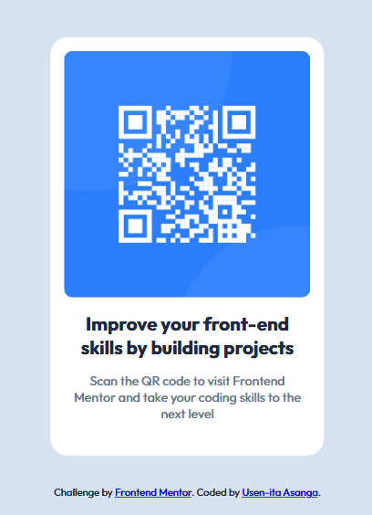

# Frontend Mentor - QR code component solution

This is a solution to the [QR code component challenge on Frontend Mentor](https://www.frontendmentor.io/challenges/qr-code-component-iux_sIO_H). Frontend Mentor challenges help you improve your coding skills by building realistic projects. 

## Table of contents

- [Overview](#overview)
  - [Screenshot](#screenshot)
  - [Links](#links)
- [My process](#my-process)
  - [Built with](#built-with)
  - [What I learned](#what-i-learned)
  - [Continued development](#continued-development)
  - [Useful resources](#useful-resources)
  - [AI Collaboration](#ai-collaboration)
- [Author](#author)

## Overview

This README documents a Frontend Mentor QR code component project. I describe the implementation process, including semantic HTML, CSS variables, Flexbox, mobile-first design, accessibility testing, and responsive testing. I also explain lessons learned about CSS variables and fallbacks, lists a helpful resource, notes how GitHub Copilot was used, and provides project and author links.

### Screenshot

### Links

- Solution URL: (https://github.com/Usen-ita/qr-code-component-main)
- Live Site URL: (https://qr-code-component-usen.netlify.app/)

## My process

- created css variables for the colours, typography and card borders to make it easier to edit repetitive styles.
- linked the css file to the index.html.
- drafted the html and css.
- Used Chrome browser extension, Wave to check for accessibility errors like colour Contrast ratios.
- Used Screen-reader to test for visually impaired accessibility.
- Tested the live page responsively using Chrome browser developer tools.

### Built with

- Semantic HTML5 markup
- CSS custom properties
- Flexbox
- CSS variables
- Mobile-first workflow

### What I learned

I completed html&css course that made feel super confident to get started wit challenges. Until I researched about css variables and browser compatibility fallbacks. I decided to incorporate my new knowledge into this challenge and was surprised how easy it was to edit repetitive styles.

### Continued development

I intend on applying css variables as many times as possible to future projects as i find it very useful.

### Useful resources

- (https://youtu.be/PHO6TBq_auI?si=AcJbpkx3Srflrfo2) - This helped me deepen my knowledge on CSS variables and fallbacks.

### AI Collaboration

GitHub Copilot help me speed up writing the css variable fallbacks and brainstorming solutions.
Parts that didn't work well were the suggestions to the Css 'H1' and 'p' padding and margins as they didnt match the Figma file.

## Author

- Website - [Usen-ita Asanga](https://www.linkedin.com/in/usen-ita-u-asanga|)
- Frontend Mentor - [@Usen-ita](https://www.frontendmentor.io/profile/Usen-ita)
- Twitter - [@usen_web](https://x.com/usen_web)

